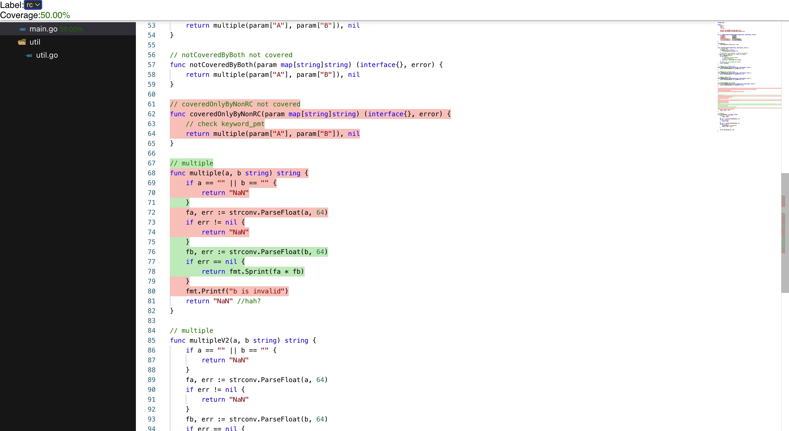

# What's this?

Provide a greatly customizable coverage visualizer.

I ever admired that code-cov or gitlab, or sonarqube had a pretty nice UI to show file coverage, comparing to the default output by `go tool cover -html=cover.out`.

But after searching github I did not find they or other persons had made a ready to use tool. And I doubt that even one is there will it suite my needs?

So I decided to make an open source coverage visualizer with highly customization and multi-language support with modern javascript techniques.

# Features

- coverage statistics, shown hierarchically
- nice decorations
- label filtering
- more...

# Get started

```bash
# clone this repo
git clone https://github.com/xhd2015/coverage-visualizer
cd coverage-visualizer

# run npm intall, add --force if failed.
npm install
npm run build

# open another terminal, serve at http://localhost:8000
npx http-server --port 8000

# open dist/editor-basic-self-contained.html
open http://localhost:8000/dist/editor-basic-self-contained.html
```

Output:


# FAQ

## monaco-editor icons missing?

There is historically a problem with loading monaco-editor's tff file, it will cause icons to be displayed as blank sqaure, see the [issue#1949 Icons not visible in find widget after Upgrading monaco-editor to 0.19.0](https://github.com/microsoft/monaco-editor/issues/1949)

I actually find a solution that simply works: just copy the `codicon.ttf` to your build directory, and dynamically import it via css.

1. copy the ttf using webpack

```bash
npm install copy-webpack-plugin --save-dev
```

update `webpack.config.js`

```js
// ...your code....

const path = require("path");
const CopyPlugin = require("copy-webpack-plugin");

module.exports = {
  // ...your code....

  plugins: [
    // ...your code....

    // cp node_modules/monaco-editor/esm/vs/base/browser/ui/codicons/codicon/codicon.ttf dist/build/monaco-code-icons.tff
    new CopyPlugin({
      patterns: [
        {
          from: path.resolve(
            __dirname,
            "node_modules/monaco-editor/esm/vs/base/browser/ui/codicons/codicon/codicon.ttf"
          ),
          to: path.resolve(__dirname, "dist/build/monaco-code-icons.tff"),
        },
      ],
    }),
  ],
};
```

2. Load the ttf dynamically

We import the tff using dynamic load, see [./src/support/components/v2/Code.tsx](./src/support/components/v2/Code.tsx) for details.

```js
let codeIconsTTFLoaded = false;
function ensureCodeIconsTTFLoaded() {
  if (codeIconsTTFLoaded) {
    return;
  }
  codeIconsTTFLoaded = true;
  // runtime import
  const dynStyle = document.createElement("style");
  dynStyle.textContent = ` @font-face {
            font-family: "codicon";
            src: url("/build/monaco-code-icons.tff");
          }`;
  document.body.appendChild(dynStyle);
}

ensureCodeIconsTTFLoaded();
```

# What's bebind this?

Behind this repository are monaco-editor,and code directly imported from [monaco-tree](https://github.com/BlueMagnificent/monaco-tree).

Check [documentation](./doc/) for more details.

# Work in progress

Work still in progress, currently the default golang coverage visualizer is implemented.
